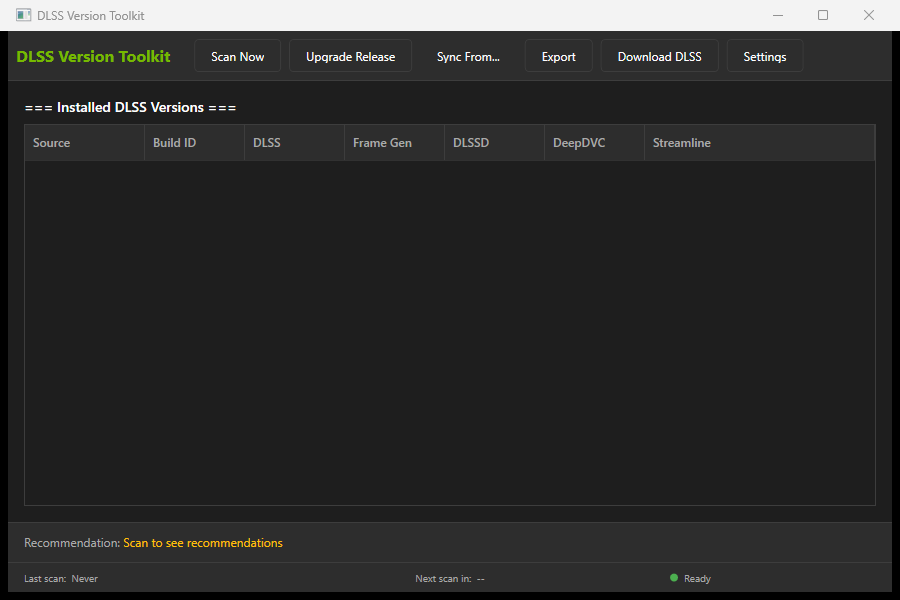
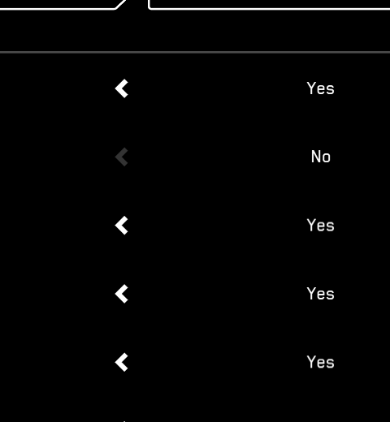

# DLSS Version Toolkit

> A Windows GUI for checking, upgrading, and syncing NVIDIA DLSS versions across all sources. Built by Scubamount.



## Overview

NVIDIA DLSS components live in multiple locations on your system. Two are managed by the NVIDIA App and drivers, one is installed automatically by this tool, and one is optional:

| Source | Description | Auto-installed? |
|--------|-------------|-----------------|
| **NGX Release** | Active DLSS override used by games | Yes — by NVIDIA App |
| **NGX Staging** | Driver-staged DLSS versions | Yes — by NVIDIA drivers |
| **AnWave** | Global DLL injection override | Yes — auto-installed by this tool from [SimonMacer/AnWave](https://github.com/SimonMacer/AnWave) |
| **Streamline SDK** | NVIDIA's SDK with the latest DLLs | Yes — auto-downloaded from NVIDIA-RTX/Streamline on GitHub |

This tool also downloads the official **DLSS SDK** (`ngx_dlss_demo_windows.zip`) from [NVIDIA/DLSS](https://github.com/NVIDIA/DLSS) on GitHub automatically — no manual download needed.

**Supported components:** DLSS, Frame Generation (dlssg), DLSSD, DeepDVC, Streamline SDK

## Features

- **Visual dashboard** — see all DLSS versions at a glance in a clean dark-themed table
- **Update All** — one button to download the latest DLSS SDK, sync to NGX Release, and apply to AnWave
- **AnWave auto-setup** — downloads and installs nvidiaDlssGlom from GitHub, fetches the latest DLSS DLLs from NVIDIA, and activates the global DLSS override automatically
- **Sync from any source** — pull newer DLLs from Streamline SDK or AnWave into NGX Release
- **Download latest DLSS** — fetch the newest official DLSS SDK directly from NVIDIA's GitHub; cached locally and skipped if already present
- **Export** — save version reports as CSV or JSON
- **System tray** — minimize to tray with notifications when new versions are detected
- **Background scanning** — optionally check for updates every 4 hours automatically
- **Hardened operations** — PE header verification, post-copy file validation, automatic rollback on failure, path allowlisting
- **Improved dialogs** — every operation result shows version numbers, file lists, and actionable next-step guidance

## Screenshots

### Main Dashboard


### Settings


## Requirements

- Windows 10 version 1903+ or Windows 11
- .NET 9 Runtime ([download .NET 9](https://dotnet.microsoft.com/download/dotnet/9.0))
- NVIDIA GPU with DLSS support
- NVIDIA App with DLSS override enabled

## Installation

### Option 1: Run the .exe

```powershell
git clone https://github.com/scubamount/dlss-version-toolkit.git
cd dlss-version-toolkit
.\publish\DLSSVersionToolkit.exe
```

### Option 2: Build from Source

```powershell
# Requires .NET 9 SDK
git clone https://github.com/scubamount/dlss-version-toolkit.git
cd dlss-version-toolkit

# Build
dotnet build src/DLSSVersionToolkit.sln --configuration Release

# Publish single-file exe
dotnet publish src/DLSSVersionToolkit/DLSSVersionToolkit.csproj --configuration Release --self-contained false
```

## Usage

### First Launch

On first launch, the app scans all known DLSS sources automatically. The dashboard shows your current DLSS versions and whether an update is available.

If AnWave is not installed, the status panel shows "Not installed" — click **Setup AnWave** in the Advanced section to install it automatically.

### The Dashboard

The main window shows:
- **Current version** — the DLSS version currently active in NGX Release
- **Available version** — the latest version cached locally (from NVIDIA's GitHub)
- **Update status** — whether a newer version is available
- **AnWave status** — whether AnWave is installed and which version is active

Green text in the table indicates the newest version for that component across all sources.

### Update All (Recommended)

Click **Update All** to run the complete upgrade workflow:

1. Downloads the latest DLSS SDK from NVIDIA/DLSS on GitHub (skipped if already cached)
2. Syncs the SDK DLLs to NGX Release (with automatic backup)
3. Applies the updated DLLs to AnWave (if installed)

Each step shows a dialog with the version applied, files copied, and what to do next.

### Advanced Operations

Expand the **Advanced** section for individual operations:

- **Sync from Streamline SDK** — copy DLLs from a Streamline SDK installation to NGX Release
- **Sync from AnWave** — copy DLLs from AnWave to NGX Release
- **Sync from DLSS SDK** — apply the cached DLSS SDK to NGX Release
- **Download Latest** — download the newest DLSS SDK from NVIDIA's GitHub
- **Apply to AnWave** — copy current NGX Release DLLs to AnWave
- **Setup AnWave** — download and install nvidiaDlssGlom, fetch latest DLSS DLLs, activate global override

### Export

Click **Export** to save a snapshot of your current DLSS setup as:
- **CSV** — spreadsheet-friendly format
- **JSON** — full data with metadata

### Settings

Click **Settings** to configure:
- **NGX Base Path** — where NGX is installed (default: `C:\ProgramData\NVIDIA\NGX`)
- **AnWave Path** — path to AnWave (leave empty for auto-detect)
- **Streamline SDK Path** — path to Streamline SDK (leave empty for auto-detect)
- **Periodic background scans** — enable auto-scan every 4 hours
- **Minimize to tray** — keep running in the background when the window is closed
- **Notifications** — show alerts when new DLSS versions are detected

### System Tray

When **Minimize to tray** is enabled:
- Closing the window hides the app to the system tray
- Right-click the tray icon for **Show Dashboard**, **Check Now**, or **Exit**
- Double-click the tray icon to restore the main window

## Security

DLSS Version Toolkit implements defense-in-depth for file operations:

- **Path allowlisting** — only `C:\ProgramData\NVIDIA\NGX` and `%APPDATA%\NVIDIA\NGX` are writable targets
- **PE header verification** — DLLs are checked for valid MZ/PE signatures before being copied
- **Post-copy validation** — file sizes are verified after copy to catch truncated or mismatched binaries
- **Automatic rollback** — if any operation fails, the backup is restored automatically
- **Backup isolation** — backups are stored in the same volume as the target, ensuring restoration is always possible
- **Long path support** — paths exceeding 240 characters are handled via the `\\?\` prefix
- **SharpCompress 0.48.0** — patched against CVE-2026-44788 (directory traversal in `WriteToDirectory`)

## Troubleshooting

### "Administrator access is required"

Run the app as Administrator. Upgrade and sync operations write to `C:\ProgramData\NVIDIA\NGX\`, which requires elevated permissions.

### "No DLSS versions found"

Ensure the NVIDIA App is installed and DLSS override is enabled. The NGX folder structure is created when the DLSS override feature is first used.

### DeepDVC Shows "Unknown"

This is normal — some NVIDIA driver builds don't include DeepDVC in the NGX config file. The toolkit handles this gracefully.

### "AnWave not installed"

Click **Setup AnWave** in the Advanced section. The app downloads nvidiaDlssGlom from [SimonMacer/AnWave](https://github.com/SimonMacer/AnWave), fetches the latest DLSS DLLs from NVIDIA, and activates the global override automatically. No manual download required.

### "Streamline SDK not found"

The app automatically downloads the Streamline SDK from NVIDIA-RTX/Streamline on GitHub when needed. If you have a manual Streamline SDK installation, place the extracted folder in your Downloads directory for auto-detection, or specify its path in Settings.

### Download fails

Ensure you have an active internet connection. The app uses the GitHub API to check for releases. If rate-limited, try again in a few minutes.

## Project Structure

```
dlss-version-toolkit/
├── src/
│   ├── DLSSVersionToolkit.Core/          # Core logic library (no WPF dependency)
│   │   ├── Models/                       # DLSSVersionEntry, ScanResult, UpgradeOperation, etc.
│   │   └── Services/                     # NgxScanner, UpgradeService, DlssDownloadService,
│   │                                      # AnWaveAutoService, BackupService, etc.
│   ├── DLSSVersionToolkit/               # WPF application
│   │   ├── ViewModels/                   # MainViewModel (CommunityToolkit.Mvvm)
│   │   ├── Views/                        # SettingsDialog
│   │   ├── Converters/                   # UI value converters
│   │   └── App.xaml                      # Dark theme, styles, startup
│   └── DLSSVersionToolkit.sln
├── publish/
│   └── DLSSVersionToolkit.exe            # Single-file release (~918 KB)
├── docs/                                  # Screenshots for documentation
├── specs/                                  # Feature specs and plans
└── README.md
```

## Technology

- **.NET 9 + WPF** — framework-dependent single-file deployment
- **CommunityToolkit.Mvvm** — source-generated observable properties and commands
- **Hardcodet.NotifyIcon.Wpf** — system tray integration
- **SharpCompress 0.48.0** — .rar extraction for nvidiaDlssGlom packages
- **System.IO.Compression.ZipFile** — built-in .zip extraction for NVIDIA DLSS SDK

## License

MIT