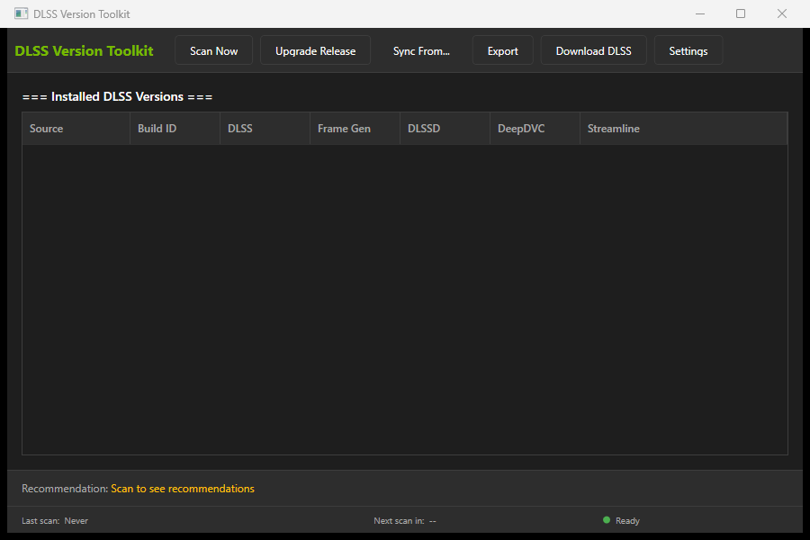

# DLSS Version Toolkit

<p align="center">
  
</p>

<p align="center">
  <a href="https://github.com/scubamount/dlss-version-toolkit/releases/latest"></a>
  <a href="https://github.com/scubamount/dlss-version-toolkit/releases"></a>
  <a href="https://github.com/scubamount/dlss-version-toolkit/stargazers"></a>
  <a href="LICENSE"></a>
  
  
</p>

<p align="center">
  <a href="#tldr">TL;DR</a> ·
  <a href="#install">Install</a> ·
  <a href="#what-it-does">What It Does</a> ·
  <a href="#how-it-works">How It Works</a> ·
  <a href="#troubleshooting">Troubleshooting</a> ·
  <a href="#security">Security</a>
</p>

---

## TL;DR

**DLSS Version Toolkit** is a Windows app that keeps your NVIDIA DLSS DLLs up to date and
forces the render preset you want — across every game — in one click.

> **Pick your presets → click Update All → restart your game.** The toolkit scans every place DLSS
> lives on your system — NGX Release, the driver's OTA/staged versions, Streamline, and AnWave —
> finds the newest build of each DLL (Super Resolution, Frame Generation, Ray Reconstruction,
> DeepDVC, DLSSNR), downloads the latest official Streamline and DLSS SDKs, syncs those DLLs into NGX
> Release (and mirrors them to AnWave), whitelists the NVIDIA App so it stops reverting your
> choice, unlocks games it marks "not supported", and applies your presets to every game profile.
> It also updates itself.

Single-file `.exe`. No installer. Your DLLs, your machine.

---

## Install

### Run the .exe (recommended)

Download **`DLSSVersionToolkit.exe`** from the
[latest release](https://github.com/scubamount/dlss-version-toolkit/releases/latest) and run it.
No installer — it's a single-file executable. Requires the
[.NET 9 Desktop Runtime](https://dotnet.microsoft.com/download/dotnet/9.0)
(Windows shows a "Download it now" dialog if missing — or install via
`winget install Microsoft.DotNet.DesktopRuntime.9`).

The app updates itself: when a newer release ships, an **update-available** pill appears
in the header — click it to download, swap, and restart in place. Toggle off in Settings.

### Build from source

```powershell
# Requires the .NET 9 SDK
git clone https://github.com/scubamount/dlss-version-toolkit.git
cd dlss-version-toolkit
dotnet build src/DLSSVersionToolkit.sln --configuration Release
dotnet publish src/DLSSVersionToolkit/DLSSVersionToolkit.csproj --configuration Release --self-contained false --runtime win-x64
```

**Requirements:** Windows 10 (1903+) or 11 · NVIDIA GPU with DLSS support · NVIDIA App with
DLSS override enabled.

---

## What It Does

| Action | What happens |
|---|---|
| **Update All** | The one button, with a pre-flight dialog that confirms the run and can import local DLLs before anything starts. Then: whitelist → unlock "not supported" games → apply presets to all games → download Streamline + DLSS SDK → sync to NGX Release → import/re-assert local overrides → set up or update AnWave. A run-report drawer names every step's outcome, including what was skipped and why |
| **Override Presets** | Separate **DLSS-SR**, **DLSS-RR** and **DLSS-FG** preset pickers (Default, A–M, or Latest) applied to the base profile **and every game profile** |
| **Reset all overrides…** | Puts back what the toolkit changed: driver preset and frame-generation settings return to their pre-toolkit values on each profile (NVIDIA's default where nothing was set). The first Reset after upgrading from v0.76 or earlier cannot tell earlier toolkit writes from your own, so it returns every game profile to NVIDIA's default (the dialog says so); later Resets are exact. `nvngx_config.txt` and the DLSS indicator return to their recorded baseline. The current config is backed up first. DLL files in the NGX folder are not removed |
| **Frame Generation control** | DLSS-FG **mode** (Don't change / Off / Fixed / Auto / Dynamic) and **multiplier** (2x–6x) — your selections persist between launches |
| **Import Local DLLs** | Have a DLL NVIDIA doesn't publish (a leak, a modded build)? Import loose `nvngx_*.dll` files directly. The toolkit records them in an override manifest so Update All preserves them instead of silently overwriting — and re-applies them after every sync unless an official release supersedes them |
| **Unlock Unsupported Games** | For titles the NVIDIA App marks "not supported" (e.g. Star Citizen) — makes the DLSS override options appear. Included in Update All |
| **Auto-scan on launch** | Opens straight to your installed versions, newest-build highlight, and live whitelist / AnWave status — no clicking required |
| **Index Game Profiles** | Caches which driver profiles belong to installed games, so applying presets skips the ~8,000-profile scan. Auto-refreshes when the driver changes |
| **App auto-update** | Checks this repo on launch and offers a one-click in-place update |
| **AnWave auto-setup** | Downloads + installs nvidiaDlssGlom, fetches the latest DLSS DLLs, activates the global override |
| **NGX Backups** | Every sync backs up the current NGX DLLs first; the Backups dialog restores any of them with its own safety backup |
| **Export** | Save a snapshot of your DLSS setup as CSV or JSON |
| **Advanced (manual)** | Import Local DLLs without a full run (Update All also offers it in its pre-flight dialog), SDK downloads into the cache without applying them, profile indexing, and under **More tools**: whitelist, unlock, export and NGX backups |
| **DLSS Indicator** | Top-right toggle for NVIDIA's on-screen DLSS overlay, to check in-game which DLL and preset loaded |
| **Your Games** | Lists the game profiles the driver knows for installed games |

### How versions are reported

Every version the app shows — the header, each INSTALLED VERSIONS cell, the completion dialog,
the run report — is read from that specific file's own PE version resource. Nothing is derived
from a folder name, a sidecar config, or the version an update *intended* to install. The
`nvngx_package_config.txt` the driver writes is treated as activation state only; it goes stale
the moment a DLL is swapped, which is what used to put mismatched versions in the grid.

Three status codes, and they mean different things:

| Cell shows | Meaning |
|---|---|
| `310.7.128.0` | The file is present and this is its version |
| `Unknown` | The file **is** there but its version could not be read — corrupt, or held open by a running game |
| `—` | No such file in this tree. Nothing is wrong; that component just isn't installed here |
| `N/A` | Not applicable to this row (e.g. Streamline on an NGX row, which never contains `sl.common.dll`) |

**LATEST AVAILABLE** compares against NVIDIA's feeds, and labels which one it used:

- **GitHub** — NVIDIA's published SDK releases (`NVIDIA/DLSS`, `NVIDIA-RTX/Streamline`). This is
  what a developer builds against.
- **OTA** — NVIDIA's NGX production update channel, the one the driver itself pulls from. It
  usually runs ahead of GitHub (for example DLSS 310.7.128 via OTA while GitHub's newest release
  was 310.7.0), which is why a version here can legitimately be higher than the latest GitHub tag.
- **OTA pre-release** — NVIDIA's staging channel, consulted by default since v0.73. It runs ahead
  of production again (310.9.0 / Streamline 2.14.0 while production served 310.7.128 / 2.12.128).

All three feeds are consulted out of the box, because the question this tool answers is "what
versions exist?" and an answer that silently omits one is wrong. Staging builds are real, published
NVIDIA builds, but the driver does not hand them to a game on its own, so they are labelled
`OTA pre-release` wherever they appear. A staging version is only ever shown when it is strictly
newer than every other feed — if production catches up to the same number, production wins and the
pre-release label disappears. Turn it off with **Settings → Include pre-release (staging)
channel**.

If the OTA endpoint is unreachable, the GitHub answer stands and nothing breaks.

### Where downloads come from

Every DLL the toolkit installs today comes from GitHub (the Streamline and DLSS SDK releases), from
AnWave's own release, or from a folder you import yourself. NVIDIA's OTA channel is read only to
learn which versions exist; no OTA payload is downloaded yet.

**Settings → Allow downloads from NVIDIA's OTA channel** and **I accept responsibility for fetching
NVIDIA components** are saved, but nothing reads them yet. They are in place for an OTA download
path whose verification steps are written and tested (HTTPS only, the published digest must match,
the payload must be a PE image signed by NVIDIA, and it moves into place only after every check
passes), but no part of the app calls it. Until it ships, these two settings change nothing.

**Supported components:** DLSS, Frame Generation (dlssg), DLSSD (Ray Reconstruction), DeepDVC, DLSSNR, Streamline SDK (incl. global Streamline-plugin override — `sl.common`, `sl.interposer`, `sl.dlss_g`, and friends — same mechanism as the DLSS override).

> **DLSSNR (DLSS 5 neural rendering) — what this tool does with it:** it scans, displays, syncs,
> backs up, and **imports** `nvngx_dlssnr.dll` like any other NGX component. No download channel
> ships it yet (as of 2026-08 it comes out of game builds), so the workflow is: extract
> `nvngx_dlssnr.dll` from the game, drop it in your import folder, run **Import Local DLLs** — it
> lands in the NGX model tree, gets a manifest record, survives Update All (NR imports are never
> marked superseded, since no download channel can supersede them), and AnWave mirrors it when
> present. What the tool does NOT do is write a driver NR-override config section — the driver's
> DLSS-NR override entries (present in 610.xx drivers, and NVIDIA's own profile entries name a
> "DLSS-NR Streamline Override") are not yet functional, so loading NR still depends on what the
> game build itself does or a per-game placement.

---

## How It Works

NVIDIA DLSS DLLs live in several places. The toolkit scans, compares, and syncs all of them:

| Source | What it is | Managed by |
|---|---|---|
| **NGX Release** | The active DLSS override games actually load | NVIDIA App |
| **NGX Staging** | Driver-staged DLSS versions | NVIDIA drivers |
| **AnWave** | Global DLL injection override | Auto-installed by this tool ([SimonMacer/AnWave](https://github.com/SimonMacer/AnWave)) |
| **Streamline SDK** | NVIDIA's SDK with the latest DLLs | Auto-downloaded ([NVIDIA-RTX/Streamline](https://github.com/NVIDIA-RTX/Streamline)) |
| **DLSS SDK** | Official `ngx_dlss_demo_windows.zip` | Auto-downloaded ([NVIDIA/DLSS](https://github.com/NVIDIA/DLSS)) |
| **Local imports** | DLLs you imported yourself, tracked in an override manifest with SHA-256 verification | This tool |

### The dashboard

- **Current NGX** → **Latest available** version strip, with an up-to-date / update-available pill.
- **Installed Versions** table — green highlights the newest build of each component across all sources; the 🔒 Override column marks locally-imported DLLs.
- **Sidebar status card** — live dots for scan, AnWave (installed + version), whitelist (applied / not), and the DLSS override (active version / off).
- **Feed health** — when GitHub or NVIDIA's OTA feed did not answer, a warning under LATEST AVAILABLE names it and the pill reads **NOT CHECKED** instead of claiming up to date.

### Update All, step by step

1. **Pre-flight** — a dialog confirms the run and optionally lets you pick a folder of local DLLs to import as part of it. After you confirm, the toolkit checks the network (only needed when no SDK is cached), ≥500 MB free disk and a writable NGX folder
2. **Whitelist** — removes the NVIDIA App override restrictions that otherwise revert your choice
3. **Unlock** — flips `IsOpsSupported` on games the NVIDIA App reports as "not supported" (backs up `ApplicationStorage.json` first)
4. **Preset sweep** — applies your SR / RR / FG presets, FG mode and multiplier to the base profile + every game profile. Each feature is handled on its own: a feature left at Default is not written at all, so overrides you set in the NVIDIA App for it stay as they are. The step runs whenever any one of the three has a preset. Profiles the driver refuses are counted and reported
5. **Streamline** — downloads the Streamline SDK (size-verified) and syncs it to NGX first: it is the comprehensive source, carrying Frame Generation, Ray Reconstruction and DeepDVC DLLs
6. **DLSS SDK** — downloads the latest official SDK from NVIDIA/DLSS (skipped if cached) and lays its newer Super Resolution DLL on top
7. **Sync** — copies to NGX Release with a verified backup + automatic rollback; if the version is unchanged but any canonical component DLL that the source actually provides is missing, it is recreated
8. **Local overrides** — imports from the pre-flight selection, then re-asserts previously-imported DLLs unless the channel has shipped something newer
9. **AnWave** — installs it if missing, then applies the updated DLLs

Whitelist, unlock, presets, local overrides and AnWave are non-fatal: a failure lands in the
completion summary and the run-report drawer, and the run continues. Five conditions stop the run
before anything is synced, because continuing would install nothing or leave NGX half-written: no
network with no cached SDK, less than 500 MB free, an NGX folder that is not writable, a DLSS SDK
download that failed with no cached copy, and an NGX sync that failed or was rolled back. The
steps after the stop point (local import, re-assert, AnWave) do not run.

> After applying, **fully restart your game** (not just to the menu). The on-screen DLSS
> indicator overlay appears in the **bottom-left** corner of supported games.

---

## Security

Defense-in-depth for every file operation:

- **Path allowlisting** — NGX syncs and imports only write under `C:\ProgramData\NVIDIA\NGX` and `%APPDATA%\NVIDIA\NGX`; a user-configured path is honored only if it is itself inside the allowlist. AnWave's DLLs go to the toolkit's own `%APPDATA%\DLSSVersionToolkit\AnWave`
- **Scoped NVIDIA App edits** — the unlock step writes a `.bak` of `ApplicationStorage.json`
  before modifying it. The whitelist step makes no backup: it flips only five named
  `Disable_*_Override` flags in `ApplicationStorage.json` and `fingerprint.db`, and Reset does not
  restore them
- **Pre-flight checks** — network, disk space, and write access verified before any download or sync
- **PE header verification** — DLLs checked for valid MZ/PE signatures before copy
- **Post-copy validation** — file sizes verified after copy to catch truncated binaries; a copy that fails verification is deleted and reported, never counted as applied
- **Local import integrity** — imported DLLs recorded with SHA-256 hashes; the manifest re-verifies the bytes on disk, so out-of-app edits are detected
- **Backup + rollback** — backups validated before any change; restored automatically on failure
- **Long path support** — backup copies over 240 chars use the `\\?\` prefix
- **SharpCompress 0.49.1** — includes the fix for CVE-2026-44788 (directory traversal in `WriteToDirectory`, fixed in 0.48.0); OSV lists no advisory for 0.49.1

The in-app auto-updater is opt-out, never silent: it downloads a size-verified exe whose
published `.sha256` checksum must match, swaps it in place with rollback on failure, and prompts
before restarting. From v0.78 it also reads the new release's `DLSSVersionToolkit.runtimeconfig.json`
and refuses an update whose .NET runtime is not installed, naming the runtime to install, so a
future move to a newer .NET cannot leave you with an exe that will not start. When that file
cannot be read, the update is still shown but not installed; clicking Update retries the check.

---

## Troubleshooting

| Symptom | Fix |
|---|---|
| **App won't launch** | Install the [.NET 9 Desktop Runtime](https://dotnet.microsoft.com/download/dotnet/9.0) — or `winget install Microsoft.DotNet.DesktopRuntime.9` |
| **"Administrator access is required to restart NVIDIA services"** | Run as Administrator — this step edits NVIDIA App data and restarts its services, which needs elevation |
| **Access denied during an NGX sync or local import** | Close any running game — a running game holds its NGX DLLs open. Sync writes go to user-writable folders (`C:\ProgramData\NVIDIA\NGX\`), so elevation normally cannot help here |
| **INSTALLED VERSIONS is empty** | Install the NVIDIA App and enable DLSS override for at least one game (this creates the NGX folders), then rescan |
| **A cell shows "Unknown"** | The DLL is there but its version could not be read. Close any game that may hold it open and rescan. `—` means the file is absent, which is normal for a component your setup does not use |
| **Sidebar AnWave dot is amber** | Click **Update All** (it auto-installs), or **Setup AnWave** in the sidebar |
| **"Streamline SDK not found"** | Auto-downloaded when needed; or drop a manual SDK in Downloads / set its path in Settings |
| **NVIDIA App says a game is "not supported"** | Run **Update All** (or **Unlock Unsupported Games**) as Administrator, then reopen the NVIDIA App. If it still doesn't appear, NVIDIA gates that title server-side and no local change will fix it |
| **Overrides revert after an NVIDIA App update** | The App can rewrite its own config when its game library changes — re-run **Update All** |
| **Changes don't show in-game** | Fully restart the game; the DLL version and preset both need a clean game launch |
| **A scan shows fewer versions than expected** | Check the scan status line — access-denied folders are now named there instead of failing silently |

---

## Project Structure

```
dlss-version-toolkit/
├── src/
│   ├── DLSSVersionToolkit.Core/      # Core logic (no WPF): scanners, services, models
│   │   ├── Models/                   # DLSSVersionEntry, ScanResult, AppUpdateInfo, …
│   │   └── Services/                 # NgxScanner, DlssDownloadService, AnWaveAutoService,
│   │                                 # LocalDllImportService, OverrideManifestService,
│   │                                 # WhitelistService, PresetOverrideService, NgxPathResolver, …
│   ├── DLSSVersionToolkit/           # WPF app
│   │   ├── ViewModels/               # MainViewModel (CommunityToolkit.Mvvm)
│   │   ├── Views/                    # SettingsDialog, BackupsDialog, UpdateAllPreflightDialog, ThemedMessageBox
│   │   ├── MainWindow.xaml           # Sidebar-dashboard UI
│   │   └── App.xaml                  # Theme, styles, startup
│   └── DLSSVersionToolkit.sln
├── tests/DLSSVersionToolkit.Tests/   # xUnit tests (590) — including gates that pin doc claims,
│                                     # bug-class regressions, and UI accessibility in CI
└── .github/workflows/                # ci.yml (build+test on push/PR) · release.yml (tag → exe; read-only build job, separate publish job)
```

The single-file `DLSSVersionToolkit.exe` (~4.4 MB, framework-dependent) is built and tested by CI on every
`v*` tag and attached to the GitHub release — it is **not** committed to the repo.

**Built with:** .NET 9 + WPF · CommunityToolkit.Mvvm · Hardcodet.NotifyIcon.Wpf ·
NvAPIWrapper.Net (DRS preset overrides) · SharpCompress.

---

## Star History

<a href="https://star-history.com/#scubamount/dlss-version-toolkit&Date">
  <picture>
    <source media="(prefers-color-scheme: dark)" srcset="https://api.star-history.com/chart?repos=scubamount/dlss-version-toolkit&type=Date&theme=dark" />
    <source media="(prefers-color-scheme: light)" srcset="https://api.star-history.com/chart?repos=scubamount/dlss-version-toolkit&type=Date" />
    
  </picture>
</a>

---

## License

[Apache License 2.0](LICENSE) — see the [NOTICE](NOTICE) file for attribution requirements.

Built and maintained by scubamount.
